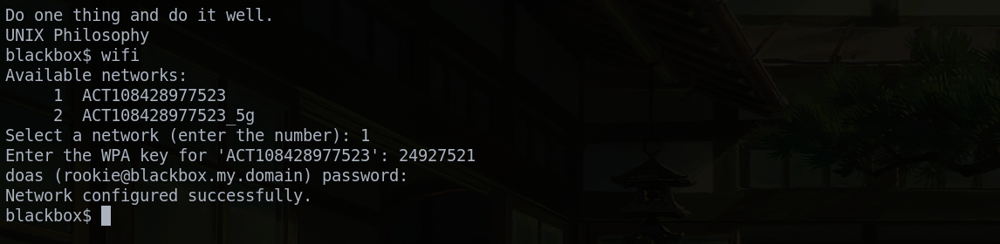

<h1 align="center">WiFi Connector for OpenBSD</h1>
<p align="center">A shell script to scan, select, and connect to WiFi networks in OpenBSD via the terminal.</p>

A lightweight shell function that allows users to scan for available WiFi networks, select one interactively, and configure the connection.

##
<p align="center">

</p>

## Installation
Run the following commands to download and install the script:

```sh
doas curl -sL "https://raw.githubusercontent.com/ganeshkumar0x/Wifi-connect-script/refs/heads/main/wifi" -o /usr/local/bin/wifi
doas chmod +x /usr/local/bin/wifi
```

## Usage
Run the script in the terminal with:

```sh
wifi
```

## Uninstallation
To remove the script, run:

```sh
doas rm /usr/local/bin/wifi
```

## License
This project is licensed under the [MIT License](LICENSE).
